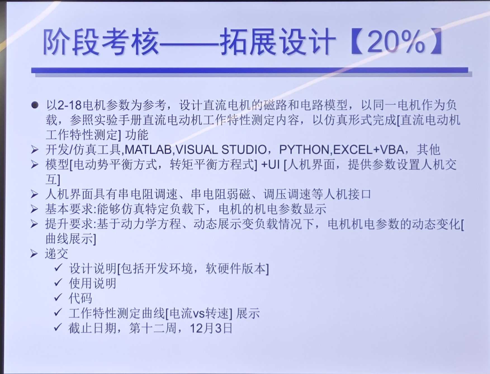

# 电机与拖动拓展设计

## 设计要求

课程PPT要求：

我的理解：
1. 需要展示什么？
**机电参数**随负载变化的曲线：
   - 功率（电功率、电磁功率和机械功率）
   - 电动势
   - 电流
   - 转速
   - 转矩
   - 效率
2. 要允许调整哪些参数？
   - 电机电压
   - 电枢回路电阻（调整转速）
   - 励磁回路电阻（调整磁通）
3. 如何依据已知参数计算展示参数？
   电路方程和动力学方程。

项目采用Pyside6开发，以GPLV3开源。